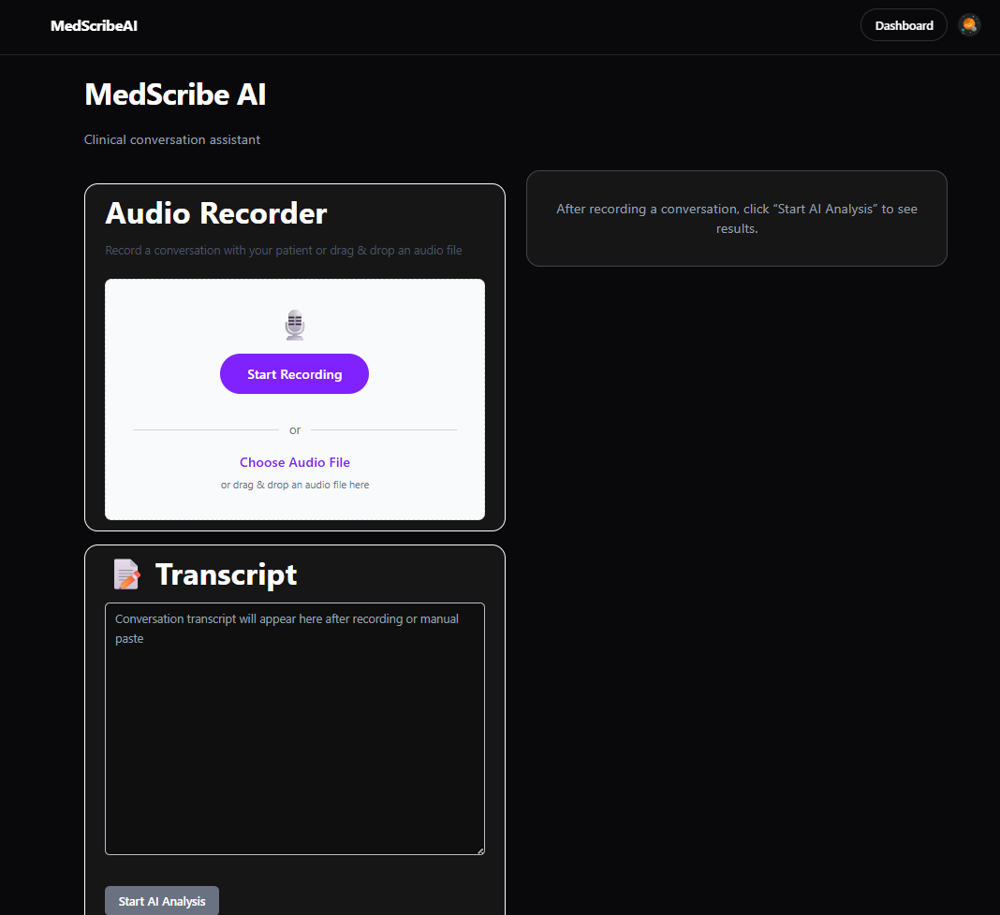
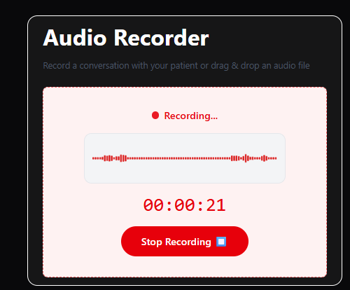
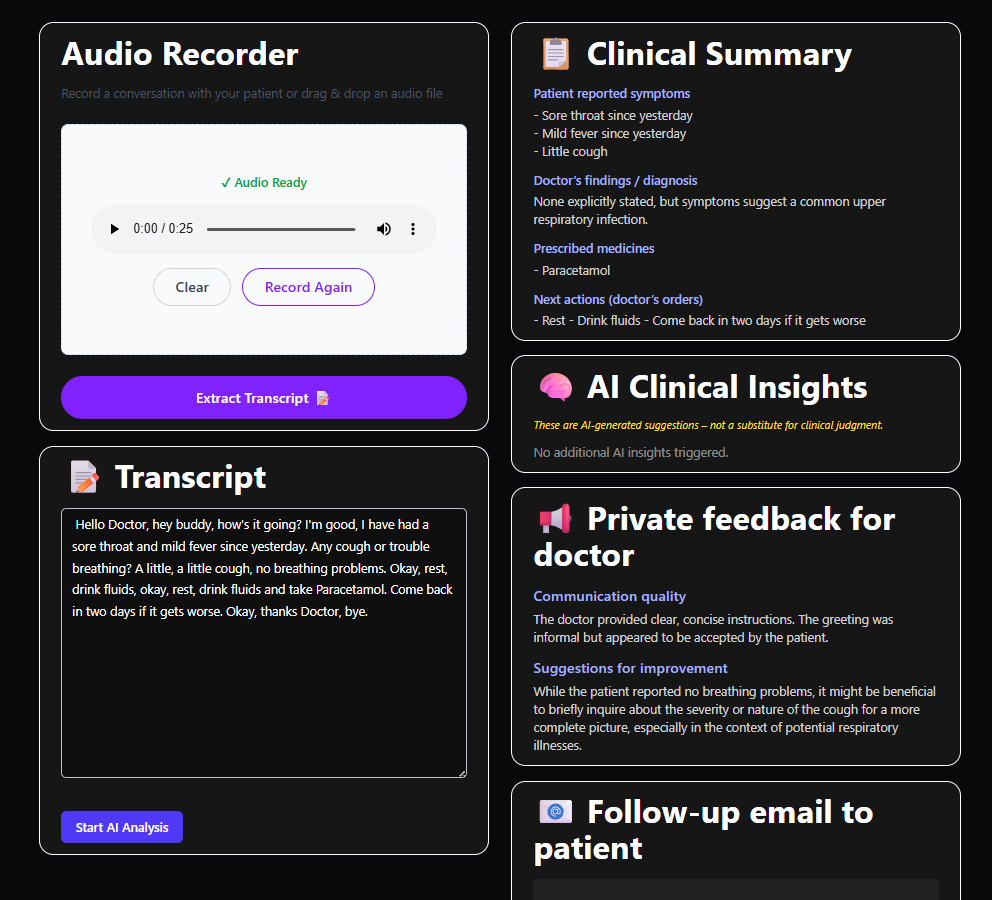
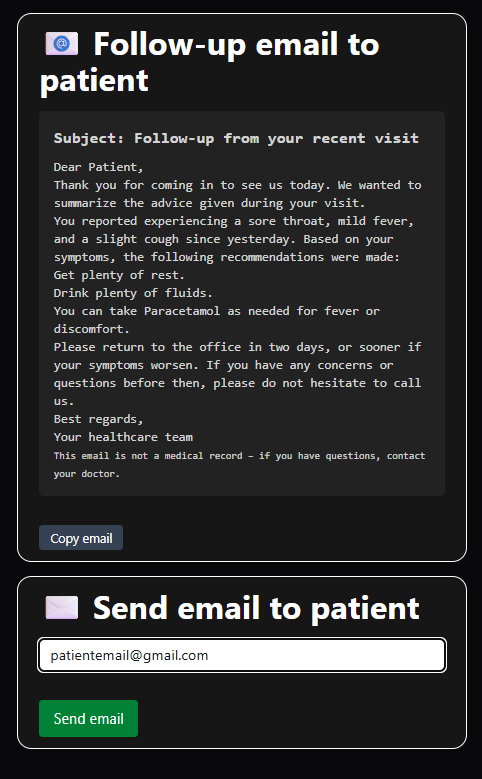

# Medscribe AI

[](https://nextjs.org/)
[](https://react.dev/)
[](https://www.typescriptlang.org/)
[](https://tailwindcss.com/)
[](https://vercel.com/)

Medscribe AI is an AI medical scribe that records doctor-patient conversations, transcribes them, and generates structured follow-up summaries.

The frontend is a SaaS-style Next.js application with authentication, protected dashboard workflows, AI analysis, rate limiting, and patient email follow-up support. It connects to a separate FastAPI transcription backend hosted on Hugging Face Spaces.

## Live Demo

- Frontend: [medscribe-ai-lilac.vercel.app/dashboard](https://medscribe-ai-lilac.vercel.app/dashboard)
- Frontend Repository: [zeyad-shaban/medscribe-ai-frontend](https://github.com/zeyad-shaban/medscribe-ai-frontend)
- Backend Space: [huggingface.co/spaces/zeyadcode/medscribe-backend](https://huggingface.co/spaces/zeyadcode/medscribe-backend)
- Backend Repository: [zeyad-shaban/medscribe-ai-backend](https://github.com/zeyad-shaban/medscribe-ai-backend)
- Demo Video: [YouTube walkthrough](https://youtu.be/qco3Urdr8m8)

<a href="https://youtu.be/qco3Urdr8m8">
  
</a>

## Screenshots

Add screenshots to `docs/assets/` using these filenames. The README is already wired to render them once the files are added.

| Dashboard | Recording Flow |
| --- | --- |
|  |  |

| AI Analysis | Patient Email |
| --- | --- |
|  |  |

## What It Does

- Records clinical conversations directly in the browser.
- Supports audio file upload through a drag-and-drop recorder card.
- Sends audio to a hosted transcription API powered by Groq Whisper.
- Lets the doctor edit the transcript before running AI analysis.
- Uses Gemini to generate structured clinical summaries, follow-up actions, doctor feedback, safety considerations, and patient-friendly email content.
- Enforces Clerk authentication and protects the dashboard route.
- Uses Clerk feature gating to separate free and premium analysis usage.
- Applies Upstash Redis rate limiting for free-tier users.
- Sends generated follow-up emails through a server-side Nodemailer route.

## Engineering Highlights

- End-to-end AI workflow from browser audio capture to transcription, LLM analysis, structured rendering, and email delivery.
- Structured prompt engineering that returns machine-readable JSON for predictable UI rendering.
- Runtime response validation with Zod before accepting transcription data from the backend.
- SaaS-style product architecture with authentication, protected routes, feature gating, and rate limiting.
- Split frontend/backend deployment model: Vercel for the web app and Hugging Face Spaces for the audio transcription service.
- Built as a solo full-stack project covering product design, frontend engineering, backend integration, AI integration, deployment, and CI/CD.

## Architecture

```mermaid
flowchart LR
    User[Doctor] --> Browser[Next.js Dashboard]
    Browser --> Recorder[Browser Recorder or Audio Upload]
    Recorder --> TranscribeRoute[/api/transcribe]
    TranscribeRoute --> HF[FastAPI Backend on Hugging Face Spaces]
    HF --> Groq[Groq Whisper Transcription]
    Groq --> Transcript[Editable Transcript]
    Transcript --> AnalysisRoute[/api/ai_analysis]
    AnalysisRoute --> Gemini[Google Gemini]
    Gemini --> Results[Summary, Insights, Feedback, Follow-up Email]
    Results --> EmailRoute[/api/send_email]
    EmailRoute --> SMTP[Gmail SMTP via Nodemailer]
```

## Tech Stack

| Area | Technology |
| --- | --- |
| Framework | Next.js 16 App Router |
| UI | React 19, Tailwind CSS 4 |
| Language | TypeScript |
| Authentication | Clerk |
| Feature gating | Clerk billing/features |
| Rate limiting | Upstash Redis, `@upstash/ratelimit` |
| Medical analysis | Google Gemini via `@google/generative-ai` |
| Transcription backend | FastAPI service hosted on Hugging Face Spaces |
| Email | Nodemailer with Gmail SMTP |
| Validation | Zod |
| Deployment | Vercel |

## Core Workflow

1. A doctor signs in through Clerk and opens the protected dashboard.
2. The doctor records a conversation or uploads an audio file.
3. The frontend posts the audio to `/api/transcribe`.
4. `/api/transcribe` forwards the file to the hosted FastAPI backend.
5. The backend cleans the audio, transcribes it with Groq Whisper, and returns a typed response.
6. The transcript appears in an editable text area.
7. The doctor sends the transcript to `/api/ai_analysis`.
8. Gemini returns a structured JSON object with summary, clinical considerations, doctor feedback, and follow-up email content.
9. The doctor can send the generated patient email through `/api/send_email`.

## API Routes

| Route | Purpose |
| --- | --- |
| `POST /api/transcribe` | Accepts an audio file, forwards it to the hosted FastAPI backend, validates the transcription response, and returns transcript metadata. |
| `POST /api/ai_analysis` | Authenticates the user, applies free-tier rate limits, sends the transcript to Gemini, and returns structured clinical analysis JSON. |
| `POST /api/send_email` | Sends the generated follow-up email to a patient using Nodemailer. |

## Local Development

### Prerequisites

- Node.js 20+
- npm
- Clerk project
- Gemini API key
- Upstash Redis database
- Gmail app password or SMTP credentials

### Setup

```bash
npm install
npm run dev
```

Open [http://localhost:3000](http://localhost:3000).

### Environment Variables

Create `.env.local`:

```bash
NEXT_PUBLIC_CLERK_PUBLISHABLE_KEY=
CLERK_SECRET_KEY=

GEMINI_API_KEY=

UPSTASH_REDIS_REST_URL=
UPSTASH_REDIS_REST_TOKEN=

SMTP_USER=
SMTP_PASSWORD=
```

The transcription route currently calls the hosted backend at:

```text
https://zeyadcode-medscribe-backend.hf.space/transcribe
```

To point the frontend at a local backend during development, update the fetch URL in `src/app/api/transcribe/route.ts`.

## Scripts

```bash
npm run dev
npm run build
npm run start
npm run lint
```

## Project Structure

```text
src/
  app/
    api/
      ai_analysis/
      send_email/
      transcribe/
    dashboard/
  components/
    AnalysisResults/
    AudioRecorder/
  hooks/
  lib/
  schemas/
```

## Deployment

The frontend is deployed on Vercel and connected to the production backend hosted on Hugging Face Spaces. Vercel handles the Next.js application, API routes, environment variables, and production builds.

## Roadmap

- Add speaker separation for doctor and patient turns.
- Add separate doctor and patient profiles.
- Host more of the AI model workflow directly on Hugging Face.
- Add automatic model switching and fallback behavior during traffic spikes.
- Add automated tests before deployment.
- Expand saved visit history and exportable reports.

## Clinical Safety Scope

Medscribe AI is built as an AI-assisted documentation workflow. The generated output is intended to support clinician review, not replace clinical judgment, diagnosis, or official medical records.
